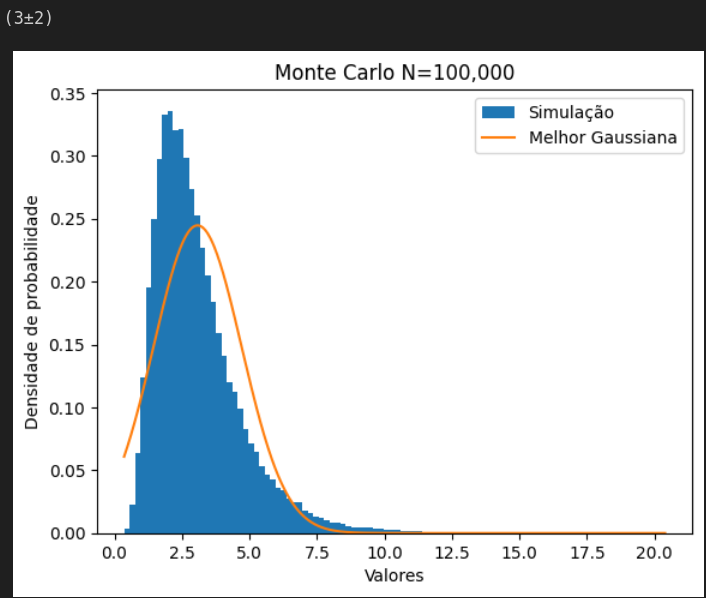
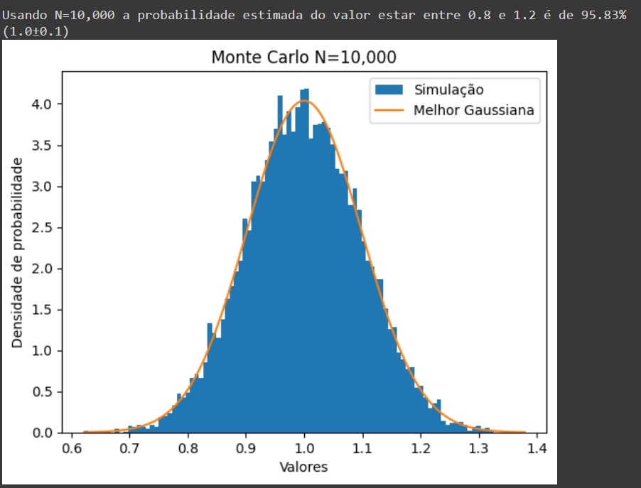

# LabIFSC

Uma biblioteca para Python 2 e Python 3 para propagação de erro e conversão de unidades utilizando os métodos (um tanto insólitos) que os professores de lab de física do IFSC-USP insistem.

## Notas sobre o fork

**Desenvolvimento**

Atualmente essa biblioteca não está mais em desenvolvimento pelos mantenedores do fork, [brenopelegrin](https://github.com/brenopelegrin/) e [viniciusdutra314](https://github.com/viniciusdutra314/). Se você quiser uma versão mais atualizada, dê uma olhada no projeto [LabIFSC2](https://github.com/viniciusdutra314/LabIFSC2) de [viniciusdutra314](https://github.com/viniciusdutra314/).

Todavia, se você tiver alguma dúvida ou quiser reportar um problema, sinta-se livre para abrir uma issue. Ela será respondida assim que possível.

**Features diferentes da biblioteca original**
 
:ballot_box_with_check: Adicionado suporte à arrays do numpy (numpy.ndarray) na função M(). Agora, quando é passado um numpy.ndarray para M(), ela retornará um numpy.ndarray tendo objetos LabIFSC.Medida.medida como seus elementos. As operações entre arrays do numpy que multiplicam elemento-elemento estão funcionando, pois as operações elemento-elemento são definidas na classe Medida.

:ballot_box_with_check: Adicionado suporte à criação de tabelas

:ballot_box_with_check: A formatação {:latex,ifsc} é ligeiramente diferente da original. Ao printar uma medida com {:latex,ifsc}, será feito da seguinte maneira: (45,4 \pm 0,01)\textrm{ m} ou (19,4 \pm 0,03)\times10^{-3}\textrm{ m³}.

## Monte Carlo 

Explicação mais extensa e exemplos da função em um [google colab](https://colab.research.google.com/github/brenopelegrin/LabIFSC/blob/master/examples/monte_carlo_examples.ipynb)

A partir das medidas $x$, que são parametros de uma função, variáveis aleatórias $X$ são geradas com distribuição normal Gauss(μ=x.nominal, σ=x.incerteza). Essas variáveis são calculadas $N$ vezes na função definida pelo usuário. 

É possível visualizar um histograma através da instalação da biblioteca [matplotlib](https://github.com/matplotlib/matplotlib) com o parâmetro hist=True. Além disso, é possível controlar a quantidade de bins bins=numero_de_bins. 
**Recomenda-se a instalação da biblioteca [numpy](https://github.com/numpy/numpy) para que os cálculos sejam realizados mais rapidamente, embora não seja obrigatório.**

A probabilidade que uma certa medida esteja entre $[a,b]$ pode ser calculada passando a lista probabilidade=$[a,b]$ em que $a$ é o menor valor e $b$ o maior valor do intervalo

## **Exemplo**
O cálculo de uma exponencial $e^{1\pm0.5}$ é efetuado, importante lembrar que a exponencial **não** é uma função nativa do LabIFSC, e também com uma alta incerteza de 50%. Para esse cálculo, é necessário inserir uma função, a qual pode ser definida como uma expressão lambda x: math.exp(x) ou como uma função definida, por exemplo, def exponencial(x): return math.exp(x). Nesse processo, a visualização do histograma é ativada com o parâmetro hist=True.


```python
    a=Medida((1,0.5))
    montecarlo(lambda x: math.exp(x),a,hist=True)
```


## Probabilidade
Exemplo da famosa regra 68-95-99.7, uma variável com distribuição gaussiana com $\mu$=1 e $\sigma=0.1$, a chance que uma medida esteja entre $[\mu -\sigma, \mu +\sigma]$ é de 68%, $[\mu -2\sigma, \mu +2\sigma]$ **95%** como ilustra o código abaixo

```python
    a=Medida((1,0.1))
    montecarlo(lambda x:x,a,probabilidade=[0.8,1.2],hist=True)
```



## Vantagens:
1. É importante destacar que o cálculo de incertezas muitos grandes não funciona com aproximações lineares, o que enfatiza a importância da utilização de simulações de Monte Carlo para essas situações.
2. O método estatístico adicionado a biblioteca pode ser aplicado em qualquer função cujas variáveis aleatórias X pertençam ao seu domínio, expandindo significativamente as possibilidades de funções que podem ser utilizadas na biblioteca.
3. A probabilidade que um resultado esteja em um certo intervalo pode ser calculada

# Sumário
- [LabIFSC](#labifsc)
  - [Monte Carlo](#monte-carlo)
  - [**Exemplo**](#exemplo)
  - [Probabilidade](#probabilidade)
  - [Vantagens:](#vantagens)
- [Sumário](#sumário)
- [Instalação](#instalação)
  - [PIP](#pip)
  - [Manualmente](#manualmente)
- [Uso](#uso)
  - [O Básico](#o-básico)
  - [Comparações](#comparações)
  - [Propagação de Erro](#propagação-de-erro)
      - [Adicionada mais funções](#adicionada-mais-funções)
  - [Unidades](#unidades)
  - [Formatação de Números](#formatação-de-números)
  - [Sequências e Tabelas](#sequências-e-tabelas)
    - [Tabelas e a função arrayM()](#tabelas-e-a-função-arraym)

# Instalação

## PIP

Instale a biblioteca usando o comando:

```!pip install git+https://github.com/brenopelegrin/LabIFSC```

## Manualmente

Caso o PIP não esteja disponível ou não funcione, é possível utilizar a LabIFSC simplesmente colocando a pasta [```LabIFSC```](https://github.com/brenopelegrin/LabIFSC/archive/master.zip) dentro da pasta em que o seu script está. Exemplo:

```
─┬ Minha pasta qualquer
 ├─ Relatório.tex
 ├─ Relatório.pdf
 ├─ Foto1.jpg
 ┊
 ├─ meu script.py
 └┬ LabIFSC
  ├─ __init__.py
  ├─ geral.py
  ├─ lista_de_unidades.py
  ├─ matematica.py
  ├─ medida.py
  ├─ tabela.py
  └─ unidade.py
```

[Download da Última Versão (.zip)](https://github.com/brenopelegrin/LabIFSC/archive/master.zip)

[Lista de Todas as Versões](https://github.com/brenopelegrin/LabIFSC/releases)

# Uso

## O Básico

Para utilizar essa biblioteca:
```python
from LabIFSC import *
```

A principal classe é a ```Medida```. Ela pode ser inicializada de diversas formas como mostrado abaixo.
(Note que todas essas medidas são iguais, o que muda é a apenas o formato)

```python
# A unidade é sempre opcional
m = Medida((130, 27), "m")  # Medida((valor nominal, erro), unidade)
m = Medida("130+-27", "m")  # Medida(valor+-erro, unidade)
m = Medida("130+/-27", "m") # Medida(valor+/-erro, unidade)
m = Medida("130±27", "m")   # Medida(valor±erro, unidade)
m = Medida("130(27)", "m")  # Medida(valor(erro), unidade)
```

Também podemos usar a abreviatura ```M()```, a qual funciona de forma bem parecida:

```python
m = M((130, 27), "m")  # Medida((valor nominal, erro), unidade)
m = M("130+-27", "m")  # Medida(valor+-erro, unidade)
m = M("130+/-27", "m") # Medida(valor+/-erro, unidade)
m = M("130±27", "m")   # Medida(valor±erro, unidade)
m = M("130(27)", "m")  # Medida(valor(erro), unidade)
```

No entanto, ```M()``` também nos permite criar listas de medidas com facilidade:

```python
w = M(np.array([1, 40, 22, 11]), incerteza=1, unidade="m")
x = M([7, 15, 28, 42, 49, 61], incerteza=1, unidade="cm")
y = M(["1", "2", "3", "4", "4", "6"], incerteza=0.01, unidade="s")
z = M(["7+-1", "15+/-0.1", "28±10", "42(3)", 49, 61], unidade="kg", incerteza=0.01)
```

Uma instância de ```Medida``` tem os seguintes atributos:

```python
m = Medida("130±27", "ft")
print(m.nominal)      # 130.0
print(m.incerteza)    # 27.0
print(m.si_nominal)   # 39.64
print(m.si_incerteza) # 8.2296
```

Os valores prefixados com ```si_``` estão em unidades do MKS, ou seja: metro, radiano, quilograma, segundo, Kelvin, Ampère e mol. As dimensões físicas são, respectivamente: comprimento (L), ângulo (A), massa (M), tempo (T), temperatura (K), corrente (I) e "número" (N). Quando uma medida é adimensional, usa-se ∅ como mostrado no excerto abaixo:

```python
# Lembre-se que lb é o símbolo para libras/pounds
M("1") # <1.0±0.0  = 1.0±0.0 ∅>
M("1", "lb/kg") # <1.0±0.0 lb kg⁻¹ = 0.45359237±0.0 ∅>
```

Também é possível converter uma medida para sua equivalente no SI usando o método ```.SI()``` como no exemplo abaixo:

```python
M("1+-0.1", "ft").SI() # <0.3048±0.03048 m = 0.3048±0.03048 L1>
```

## Comparações

As comparações entre medidas não comparam os valores em si, mas sim verificam se as medidas são estatisticamente equivalentes.

A equação que determina se duas medidas são equivalentes é: ```|x₁ - x₂| ≤ 2(σ₁ + σ₂)```. Já a equação~que determina não equivalência é ```|x₁ - x₂| > 3(σ₁ + σ₂)```.

Cuidado deve ser tomado já que duas medidas podem não ser iguais nem diferentes ao mesmo tempo.

```python
m1 = Medida("100+/-7")
m2 = Medida("110+/-3")
m1 == m2 # True
m1 != m2 # False
```

```python
m1 = Medida("100+/-7")
m2 = Medida("125+/-3")
m1 == m2 # False
m1 != m2 # False
```

```python
m1 = Medida("100+/-7")
m2 = Medida("131+/-3")
m1 == m2 # False
m1 != m2 # True
```

## Propagação de Erro

A propagação de erro é feita automaticamente nas seguintes operções: ```+```, ```-```, ```*```, ```/```, ```**```.

```python
m1 = Medida("20+/-1")
m2 = Medida("4+/-2")
print(m1+m2) # 24±3
print(m1-m2) # 16±3
print(m1*m2) # 80±40
print(m1/m2) # 5±3
print(m1**4) # 160000±30000
print(3**m2) # 81±200
print(m1**m2) # Erro
```

Infelizmente, não há propagação de erro automática nas funções da biblioteca ```math```, porém, a LabIFSC provê as seguintes funções com propagação de erro:

```python
m1 = Medida("20+/-1.5")
print(cos(m1))     # 0±1
print(sin(m1))     # 0.9±0.6
print(tan(m1))     # 2±9
print(cot(m1))     # 0±2
print(sec(m1))     # 2±8
print(csc(m1))     # 2.2±0.7
print(arc_cos(m1)) # 0.8±0.1 rad
print(arc_sin(m1)) # 0.8±0.1 rad
print(arc_tan(m1)) # 0.6±0.1 rad
print(log(m1))     # 2.73±0.07
print(log10(m1))   # 1.30±0.03
print(log2(m1))    # 4.3±0.1
print(ln(m1))      # 3±0.08
print(sqrt(m1))    # 4.5±0.2
print(cbr(m1))     # 2.71±0.0
```
#### Adicionada mais funções
 Com a função monte carlo é possível calcular a incerteza de virtualmente qualquer função, para saber mais leia [Monte Carlo](#monte-carlo)

## Unidades

Todas as medidas podem ter um parâmetro adicional de unidade após o valor. Por exemplo:

```python
m1 = Medida("1+/-0.001", "m")
m2 = Medida("1+/-0.001", "ft")
m3 = Medida("1+/-0.02", "s")
```

(O arquivo ```LabIFSC/lista_de_unidades.py``` contém todas as unidades suportadas por esta biblioteca.)

As contas de soma e subtração sempre ficam nas unidades do primeiro argumento nas operações, exceto quando o primeiro argumento for adimensional. Neste caso, as unidades serão as do segundo argumento.

Já as contas de multiplicação e divisão simplesmente combinam as unidades.

```python
# Lembre-se que ft é o símbolo para pés
print(m1+m2) #  2.610±0.001 m
print(m2+m1) #  5.586±0.004 ft
print(m1-m2) # -0.610±0.001 m
print(m2-m1) # -3.586±0.004 ft
print(m1*m2) #  1.000±0.002 ft m
print(m2*m1) #  1.000±0.002 ft m
print(m1/m2) #  1.000±0.002 m ft⁻¹
print(m2/m1) #  1.000±0.002 ft m⁻¹
print(m1*m3) #  1.00±0.02 m s
print(m1/m3) #  1.00±0.02 m s⁻¹
```

Para converter as unidades:

```python
m4 = m1*m2/m3
print(m4.converta("m^2 s^-1")) # 1.610±0.007 m² s⁻¹
print(m4.converta("m^2/s"))    # 1.610±0.007 m² s⁻¹
```

## Formatação de Números

Uma mesma ```Medida``` pode ser impressa de diferentes formas:

```python
m1 = Medida("1.23456789+/-0.015", "m lb/s")

# Formatação padrão, do jeito que os profs de lab gostam
print(m1)              # 1.23±0.02 m lb s⁻¹
print(str(m1))         # 1.23±0.02 m lb s⁻¹
print("{}".format(m1)) # 1.23±0.02 m lb s⁻¹

# Representação do objeto Medida. Temos o valor original à esquerda e o valor no SI, bem como a dimensão física, à direita
print(m1.__repr__())        # <1.23456789±0.015 m lb s⁻¹ = 0.5599905751509993±0.00680388555 L1M1T-1>
print("{:repr}".format(m1)) # <1.23456789±0.015 m lb s⁻¹ = 0.5599905751509993±0.00680388555 L1M1T-1>

# Diferentes estilos de representação com o arredondamento padrão (arredondamento ifsc)
print("{}".format(m1))          # 1.23±0.02 m lb s⁻¹
print("{:-}".format(m1))        # 1.23±0.02 m lb s⁻¹
print("{:latex}".format(m1))    # 1.23\pm0.02\textrm{ m lb s^-1}
print("{:siunitex}".format(m1)) # 1.23±0.02 m lb s⁻¹
print("{:txt}".format(m1))      # 1.23+/-0.02 m lb s^-1

# Diferentes estilos de representação com o arredondamento do ifsc
print("{}".format(m1))               # 1.23±0.02 m lb s⁻¹
print("{:-,ifsc}".format(m1))        # 1.23±0.02 m lb s⁻¹
print("{:latex,ifsc}".format(m1))    # (1.23 \\pm 0.02) \\textrm{ m lb s^-1}
print("{:siunitex,ifsc}".format(m1)) # 1.23±0.02 m lb s⁻¹
print("{:txt,ifsc}".format(m1))      # 1.23+/-0.02 m lb s^-1

# Diferentes estilos de representação sem arredondamento
print("{:-,full}".format(m1))        # 1.23456789±0.015 m lb s⁻¹
print("{:latex,full}".format(m1))    # 1.23456789\\pm0.015\\textrm{ m lb s^-1}
print("{:siunitex,full}".format(m1)) # 1.23456789±0.015 m lb s⁻¹
print("{:txt,full}".format(m1))      # 1.23456789+/-0.015 m lb s^-1

# Diferentes estilos de representação com o arredondamento do ifsc usando 10^-2 como base
print("{:-,ifsc,-2}".format(m1))        # (123±2)×10⁻² m lb s⁻¹
print("{:latex,ifsc,-2}".format(m1))    # (123\pm2)\cdot10^{-2}\textrm{ m lb s^-1}
print("{:siunitex,ifsc,-2}".format(m1)) # (123±2)×10⁻² m lb s⁻¹
print("{:txt,ifsc,-2}".format(m1))      # (123+/-2)*10^-2 m lb s^-1

# Diferentes estilos de representação sem arredondamento usando 10^-2 como base
print("{:-,full,-2}".format(m1))        # (123.45678899999999±1.5)×10⁻² m lb s⁻¹
print("{:latex,full,-2}".format(m1))    # (123.45678899999999\pm1.5)\cdot10^{-2}\textrm{ m lb s^-1}
print("{:siunitex,full,-2}".format(m1)) # (123.45678899999999±1.5)×10⁻² m lb s⁻¹
print("{:txt,full,-2}".format(m1))      # (123.45678899999999+/-1.5)*10^-2 m lb s^-1
```

## Sequências e Tabelas

Essa biblioteca provê funções para calcular média, desvio padrão e linearização de dados. Mais detalhes estão no exemplo abaixo:

```python
x = M(["147.0", "161.8", "174.6", "161.01", "175.6", "166.0"], incerteza=0.1, unidade="cm")
print(media(x))                             # 160±10 cm
print(media(x, incerteza="desvio padrão"))  # 160±10 cm
print(media(x, incerteza="propagação"))     # 164.3±0.1 cm
print(desvio_padrao(x))                     # 10.516907815513074

x = M(["7", "15", "28", "42", "49", "61"], incerteza=1, unidade="cm")
y = M(["1", "2", "3", "4", "4", "6"], incerteza=0.01, unidade="s")
linearize(x, y, imprimir=True)
x[1] = x[1].converta("m")
x[2] = x[2].converta("km")
linearize(x, y, imprimir=True)
# Note que, mesmo com unidades diferentes, as linearizações tem o mesmo resultado
```

### Tabelas e a função arrayM()

Além da [implementação original](https://github.com/gjvnq/LabIFSC) da biblioteca, foi adicionada uma classe que permite manipular tabelas e obter o resultado em LaTeX e uma função para ajudar a criar tabelas com arrays de medidas.

A classe `Tabela` possui os seguintes métodos:

| Método                       | Descrição                                                                       |
| ---------------------------- | ------------------------------------------------------------------------------- |
| addColuna(`array`, `titulo`) | Adiciona uma coluna de medidas a partir de um array e define o título da coluna |
| delColuna(`index`)           | Deleta a coluna de acordo com o índice                                          |
| gerarLatex()                 | Retorna uma string contendo o código em LaTeX                                   |

Ao adicionar a primeira coluna, você define o número de elementos máximo de cada coluna da tabela. Todas as próximas colunas precisam ter o mesmo número de linhas.

A biblioteca cuidará da formatação das unidades e incertezas:
- Se você passar um array com medidas com a mesma incerteza, a incerteza e unidade será colocada no título e removida das linhas
- Se você passar um array com medidas de incertezas diferentes, elas serão colocadas em cada linha da tabela e apenas a unidade será colocada no título
- Não é possível criar uma coluna passando um array com medidas com unidades diferentes

Exemplo de como utilizar:
```python
import LabIFSC as lab
import numpy as np

m_1 = lab.M(np.array([1.001, 2.034, 5.394]), incerteza=0.001, unidade='m')
m_2 = lab.M(np.array([1.201, 6.034, 1.694]), incerteza=0.005, unidade='kg')

# Criando um array de medidas com unidades diferentes utilizando a função M()
# Nesse caso, como um array numpy foi passado, será retornado um array numpy.
m_3 = lab.M(np.array([lab.Medida(0.5, incerteza=0.1, unidade="s"), lab.Medida(0.3, incerteza=0.05, unidade="s"), lab.Medida(0.2, incerteza=0.2, unidade="s")]))

# Criando um array de medidas com unidades diferentes utilizando a função arrayM()
# Nesse caso, a função irá retornar um array numpy pois utilizou-se um transformer np.array
m_4 = lab.arrayM(arrayNominal=np.array([0.44354, 0.12, 1.223]), incertezas=np.array([0.001, 0.1, 0.05]), unidades='ºC', transformer=np.array)

# Criando um array de medidas com unidades diferentes utilizando a função arrayM()
# Nesse caso, a função irá retornar uma lista pois utilizou-se um transformer list
m_5 = lab.arrayM(arrayNominal=[1.54, 0.123, 5.223], incertezas=0.0037, unidades='C', transformer=list)
tab = lab.Tabela(titulo='Meu titulo')

tab.addColuna(m_1, 'Distancias')
tab.addColuna(m_2, 'Massas')
tab.addColuna(m_3, 'Tempos')
tab.addColuna(m_4, 'Temperaturas')
tab.addColuna(m_5, 'Cargas')

tab.delColuna(0)

tabLatex = tab.gerarLatex()

print(tabLatex)
```

Output:

```latex
\begin{table}[H]
\centering
\caption{Meu titulo}
\label{yourLabelHere}
\begin{tabular}{|c|c|c|c|}
\hline
\textbf{Massas (kg) $\pm$ 0,005 (kg)}&\textbf{Tempos (s)}&\textbf{Temperaturas (ºC)}&\textbf{Cargas (C) $\pm$ 0,004 (C)}\\ \hline
1,201&0,5 \pm 0,1&0,444 \pm 0,001&1,540\\ \hline
6,034&0,30 \pm 0,05&0,1 \pm 0,1&0,123\\ \hline
1,694&0,2 \pm 0,2&1,22 \pm 0,05&5,223\\ \hline
\end{tabular}
\caption*{Fonte: Autoria própria}
\end{table}
```

A função `arrayM()` foi criada para ajudar à criar tabelas facilmente.

- Ela recebe um array dos valores nominais das medidas, um array de incertezas ou uma única incerteza, um array de unidades ou uma única unidade.

- Se ela receber apenas uma unidade ou incerteza, essa unidade ou incerteza será adotada para todo o array de valores nominais.

- No caso de uma unidade para todos os nominais, a unidade precisa ser um `str`. 

- No caso de uma incerteza para todos os nominais, a incerteza precisa ser um `float` ou `str`.

- No caso de arrays de incertezas e unidades, eles precisam ter o mesmo length do array de nominais.

A função funciona da seguinte forma:

```python
# Cria um array com os valores nominais, suas incertezas e unidades
# O transformer padrão é o list, então essa chamada irá retornar uma lista
nominais = [1.0, 2.1, 3.4, 0.2]
incertezas = [0.3, 0.2, 0.1, 0.1]
unidades = ['m', 'kg', 'C', 's']
medidas = lab.arrayM(nominais, incertezas, unidades)

# Cria um array com os valores nominais, suas incertezas e apenas uma unidade para todos
# Aqui, foi utilizado um transformer np.array, então irá retornar um array numpy
nominais = [1.0, 2.1, 3.4, 0.2]
incertezas = np.array([0.3, 0.2, 0.1, 0.1])
unidades = 'm'
medidas = lab.arrayM(nominais, incertezas, unidades, transformer=np.array)

# Cria um array com os valores nominais, uma incerteza para todos, e apenas uma unidade para todos
# Aqui, foi utilizado um transformer list, então irá retornar uma lista
nominais = np.array([1.0, 2.1, 3.4, 0.2])
incertezas = 0.1
unidades = 'm'
medidas = lab.arrayM(nominais, incertezas, unidades, transformer=list)

# Os inputs nominais, incertezas e unidades podem ser list ou ndarray

```

